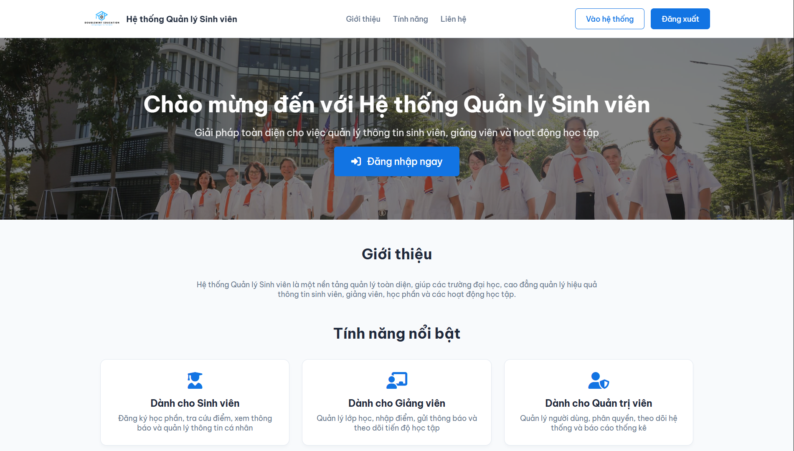
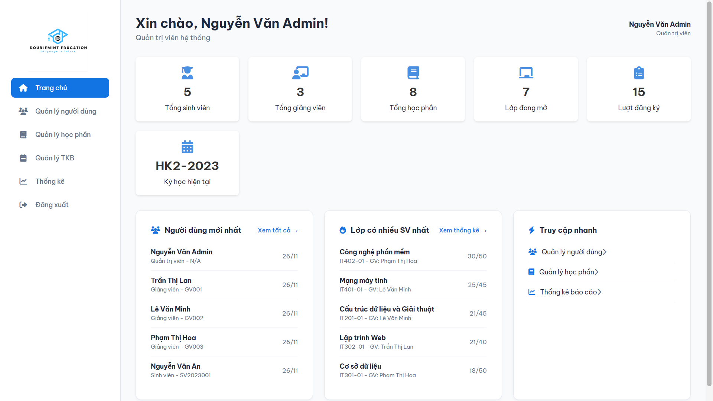
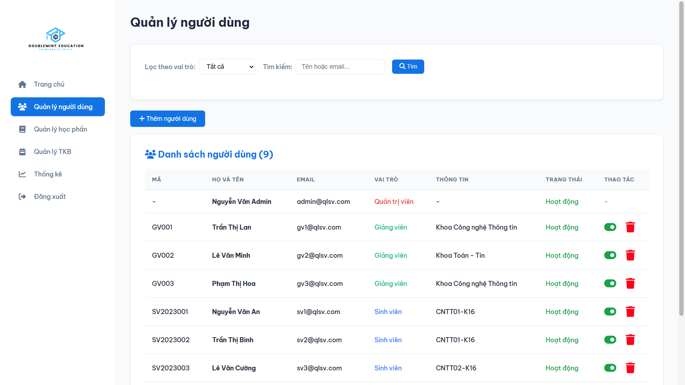
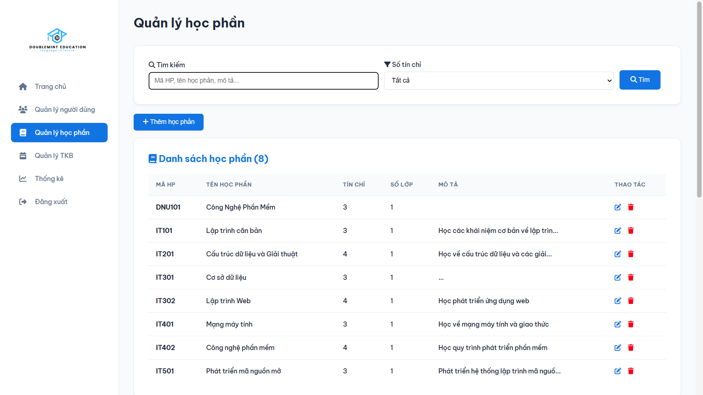
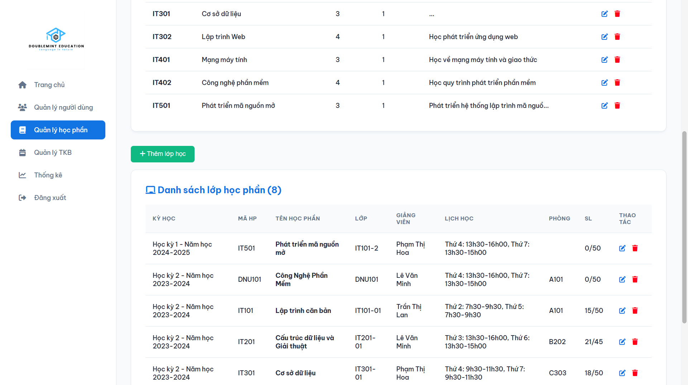
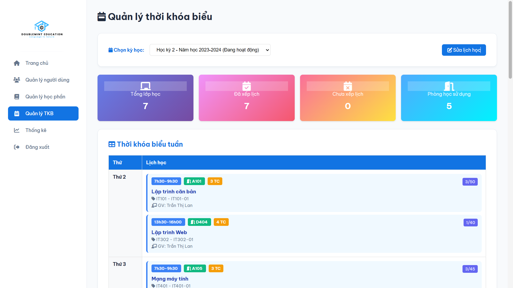
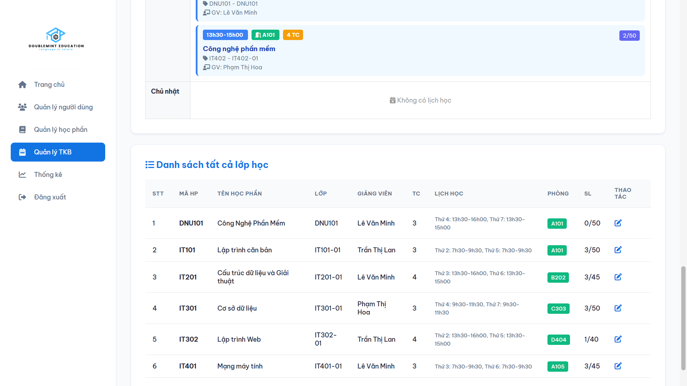
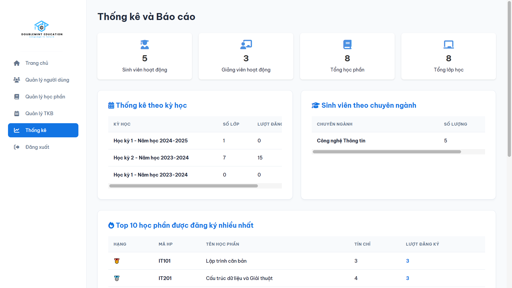
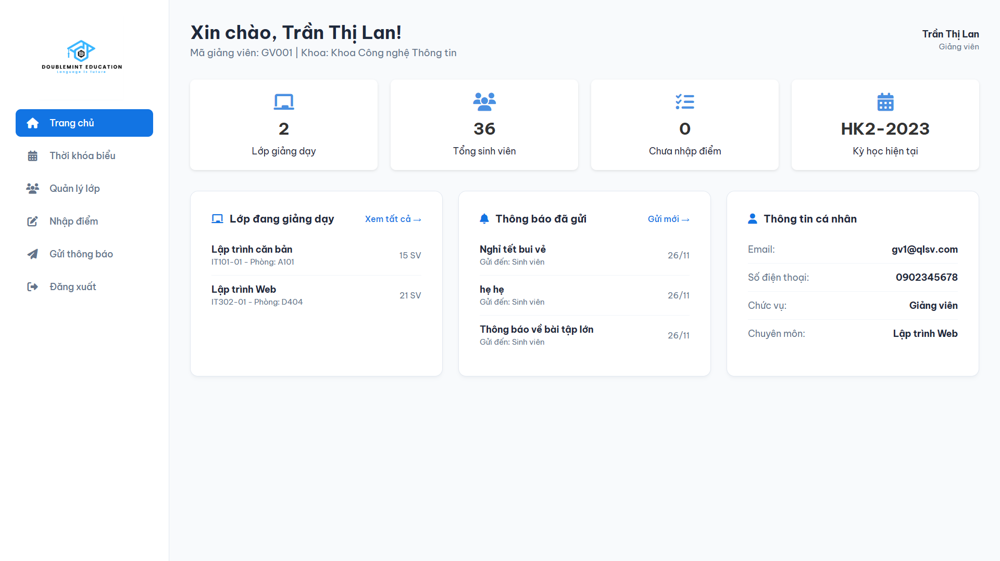

# HỆ THỐNG QUẢN LÝ SINH VIÊN

Hệ thống quản lý sinh viên có 3 tác nhân tương ứng với 3 vai trò: Sinh viên, Giảng viên, và Quản trị viên (Admin).

## THÔNG TIN DỰ ÁN

**Ngôn ngữ:** PHP (Pure PHP - không sử dụng framework)
**Database:** MySQL  
**Công nghệ:** HTML, CSS, JavaScript, MySQL

## Link Website
http://quan-ly-sinh-vien.wuaze.com
## GIAO DIỆN HỆ THỐNG

### Giao diện Admin
- Giao diện đăng nhập
<p align="center">  
     
</p>

- Giao diện ashboard
<p align="center">  
     
</p>

- Giao diện Quản lý người dùng
<p align="center">  
     
</p>

- Giao diện Quản lý học phần
<p align="center">  
      
     
</p>

- Giao diện Quản lý thời khóa biểu
<p align="center">  
      
     
</p>

- Giao diện Quản lý học phần
<p align="center">  
      
</p>

### Giao diện Giảng viên

- Giao diện ashboard
<p align="center">  
     
</p>

### Giao diện Sinh viên

- Giao diện ashboard
<p align="center">  
     
</p>
## CẤU TRÚC DỰ ÁN

```
qlsinhvien/
│
├── admin/                          # Module quản trị viên
│   ├── dashboard.php              # Trang chủ quản trị viên
│   ├── quan_ly_nguoi_dung.php     # Quản lý người dùng và phân quyền
│   ├── quan_ly_hoc_phan.php       # Quản lý học phần và lớp học
│   └── thong_ke.php               # Thống kê và báo cáo
│
├── student/                       # Module sinh viên
│   ├── dashboard.php             # Trang chủ sinh viên
│   ├── dang_ky_hoc_phan.php      # Đăng ký học phần
│   ├── tra_cuu_diem.php          # Tra cứu điểm học tập
│   └── thong_bao.php             # Xem thông báo
│
├── teacher/                       # Module giảng viên
│   ├── dashboard.php             # Trang chủ giảng viên
│   ├── quan_ly_lop.php           # Quản lý lớp học phần
│   ├── nhap_diem.php             # Nhập điểm sinh viên
│   └── gui_thong_bao.php         # Gửi thông báo
│
├── config/                        # Cấu hình hệ thống
│   ├── db_connect.php            # Kết nối database
│   └── auth.php                  # Xác thực và phân quyền
│
├── includes/                      # Các file include chung
│   ├── header.php                # Header template
│   └── footer.php                # Footer template
│
├── assets/                        # Tài nguyên tĩnh
│   ├── css/
│   │   └── style.css            # File CSS chính
│   ├── js/
│   │   └── script.js            # File JavaScript
│   └── images/                  # Thư mục hình ảnh
│
├── database/                     # Database
│   └── schema.sql               # File tạo database và dữ liệu mẫu
│
├── index.php                    # Trang chủ công khai
├── login.php                    # Trang đăng nhập
├── logout.php                   # Xử lý đăng xuất
└── access_denied.php            # Trang thông báo không có quyền
```

## HƯỚNG DẪN CÀI ĐẶT

### 1. Yêu cầu hệ thống

- XAMPP (hoặc LAMP/WAMP) với:
  - PHP 7.4 trở lên
  - MySQL 5.7 trở lên
  - Apache Web Server

### 2. Cài đặt

**Bước 1:** Sao chép thư mục dự án vào `C:\xampp\htdocs\`

**Bước 2:** Khởi động XAMPP Control Panel và bật Apache và MySQL

**Bước 3:** Tạo database
- Mở phpMyAdmin: http://localhost/phpmyadmin
- Import file `database/schema.sql` hoặc chạy nội dung file SQL trong phpMyAdmin

**Bước 4:** Cấu hình kết nối database (nếu cần)
- Mở file `config/db_connect.php`
- Kiểm tra thông tin kết nối:
  ```php
  $servername = "localhost";
  $username = "root";
  $password = "081205";  // Có thể thay đổi hoặc tùy theo mk máy bạn
  $dbname = "qlsinhvien"; 
  $port = 3306;
  ```

**Bước 5:** Truy cập hệ thống
- Mở trình duyệt và truy cập: http://localhost/qlsinhvien

## TÀI KHOẢN MẪU

Hệ thống đã tạo sẵn các tài khoản mẫu để test:

### Quản trị viên
- **Email:** admin@qlsv.com
- **Mật khẩu:** admin

### Giảng viên
- **Email:** gv1@qlsv.com
- **Mật khẩu:** 11111

### Sinh viên
- **Email:** sv1@qlsv.com
- **Mật khẩu:** 11111

## CHỨC NĂNG CHÍNH

### Dành cho Sinh viên
1. **Dashboard:** Xem tổng quan thông tin học tập
2. **Đăng ký học phần:** Đăng ký các học phần còn trống (tối đa 24 tín chỉ/kỳ)
3. **Tra cứu điểm:** Xem điểm các học phần theo từng kỳ học
4. **Thông báo:** Nhận và xem thông báo từ giảng viên/quản trị viên

### Dành cho Giảng viên
1. **Dashboard:** Xem tổng quan lớp học và sinh viên
2. **Quản lý lớp:** Xem danh sách lớp và sinh viên được phân công
3. **Nhập điểm:** Nhập điểm bài tập, giữa kỳ, cuối kỳ cho sinh viên
4. **Gửi thông báo:** Gửi thông báo đến sinh viên

### Dành cho Quản trị viên
1. **Dashboard:** Xem thống kê tổng quan hệ thống
2. **Quản lý người dùng:** Thêm, xóa, phân quyền người dùng (sinh viên, giảng viên)
3. **Quản lý học phần:** Quản lý học phần, tạo lớp học, phân công giảng viên
4. **Thống kê:** Xem các báo cáo thống kê chi tiết

## TÍNH NĂNG NỔI BẬT

✅ **Hệ thống phân quyền rõ ràng:** 3 vai trò độc lập với các chức năng riêng biệt  
✅ **Quản lý đăng ký học phần:** Kiểm tra số lượng, tín chỉ tối đa, trạng thái lớp  
✅ **Tính điểm tự động:** Điểm tổng kết = BT×30% + GK×20% + CK×50%  
✅ **Thống kê chi tiết:** Báo cáo về sinh viên, lớp học, điểm số  
✅ **Giao diện thân thiện:** Thiết kế hiện đại, responsive  
✅ **Bảo mật:** Kiểm tra quyền truy cập, escape SQL injection  

## CƠ SỞ DỮ LIỆU

### Các bảng chính:
- **users:** Thông tin người dùng (email, password, role)
- **students:** Thông tin sinh viên
- **teachers:** Thông tin giảng viên
- **semesters:** Kỳ học
- **courses:** Học phần
- **class_courses:** Lớp học phần (kết hợp học phần + giảng viên + kỳ học)
- **enrollments:** Đăng ký học phần
- **grades:** Điểm số
- **notifications:** Thông báo

## QUY TẮC NGHIỆP VỤ

1. **Đăng ký học phần:**
   - Tối đa 24 tín chỉ/kỳ
   - Không được đăng ký trùng học phần
   - Lớp phải còn chỗ trống

2. **Điểm số:**
   - Điểm từ 0-10
   - Điểm tổng kết = BT×0.3 + GK×0.2 + CK×0.5
   - Xếp loại: A+ (9.0-10), A (8.5-8.9), B+ (8.0-8.4), B (7.0-7.9), C+ (6.5-6.9), C (5.5-6.4), D+ (5.0-5.4), D (4.0-4.9), F (<4.0)

3. **Phân quyền:**
   - Mỗi vai trò chỉ truy cập được module của mình
   - Không thể xóa tài khoản đang đăng nhập

## LƯU Ý

- Mật khẩu được lưu dưới dạng plain text (để đơn giản). Trong production nên sử dụng password_hash()
- File CSS sử dụng font Be Vietnam Pro từ Google Fonts
- Icons sử dụng Font Awesome 6.4.0
- Database sử dụng charset utf8mb4 để hỗ trợ tiếng Việt

## Mẹo nhỏ

- Trong thư mục htdocs, mở file index chỉnh phần "/dashboard/" thành "/qlsinhvien/" để khi bật Admin ở Xampp thì trang web sẽ tự động truy cập vào thư mục qlsinhvien
<p align="center"> 
  
</p>

## HỖ TRỢ

Nếu gặp vấn đề:
1. Kiểm tra Apache và MySQL đã chạy chưa
2. Kiểm tra thông tin kết nối database
3. Kiểm tra file schema.sql đã được import đúng chưa
4. Xem file error log của Apache/PHP

## PHÁT TRIỂN TIẾP

Các tính năng có thể mở rộng:
- Quản lý lịch thi
- Quản lý học phí
- Xuất báo cáo PDF/Excel
- Gửi email thông báo
- Upload file bài tập
- Chat trực tuyến
- Mobile app

---

**Phát triển bởi:** Nguyễn Văn Hưởng | CNTT 17-11  
**Năm:** 2025  
**Phiên bản:** 1.1

